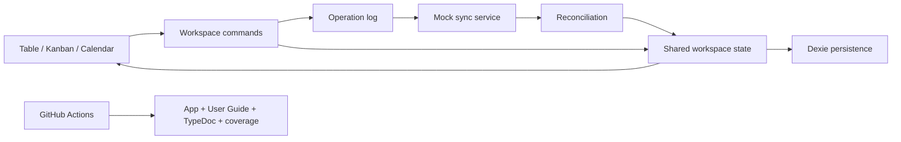

# Enterprise Data Workbench

[](https://github.com/danielemasone/enterprise-data-workbench/actions/workflows/ci.yml)

Enterprise Data Workbench is a portfolio-grade React, TypeScript and Vite application for dense, local-first enterprise workflows. Table, kanban and calendar views share one domain document while optimistic operations, persistence, synchronization and conflicts remain visible and inspectable.

- **Live demo:** [danielemasone.github.io/enterprise-data-workbench](https://danielemasone.github.io/enterprise-data-workbench/)
- **User guide:** [published product documentation](https://danielemasone.github.io/enterprise-data-workbench/guide/)
- **Source:** [github.com/danielemasone/enterprise-data-workbench](https://github.com/danielemasone/enterprise-data-workbench)
- **API reference:** [generated TypeDoc](https://danielemasone.github.io/enterprise-data-workbench/docs/)
- **Coverage:** [generated HTML report](https://danielemasone.github.io/enterprise-data-workbench/coverage/)

## Engineering Highlights

- Domain-first Zustand state with immutable commands and no per-view record copies.
- Explicit `WorkspaceOperation` log for optimistic edits, layout changes and kanban moves.
- Dexie persistence and injected service boundaries that remain testable without a browser database.
- Mock sync plus field-level reconciliation with visible local and remote conflict resolution.
- Keyboard-first grid, accessible view tabs, command palette and persisted light/dark theme.
- Vitest, Testing Library, Playwright, TypeDoc and GitHub Pages integrated into one CI pipeline.

## Feature Summary

| Area             | Implemented behavior                                                                              |
| ---------------- | ------------------------------------------------------------------------------------------------- |
| Data grid        | Inline editing, cell and row selection, sorting, keyboard navigation, resize and reorder controls |
| Shared views     | Table, kanban and calendar projections over the same `WorkbenchRecord` collection                 |
| Local-first flow | Optimistic commands, operation history, IndexedDB persistence and pending sync state              |
| Reconciliation   | Conflict simulation, local/remote comparison and explicit resolution                              |
| Productivity     | Command palette, keyboard shortcuts, fake presence and sync inspector                             |
| Portfolio shell  | Responsive layout, accessible controls, architecture view, quality links and persisted theme      |

## Architecture



The full runtime model, domain terminology and extension rules are documented in the [architecture guide](guides/architecture.md).

## Documentation

- [Published User Guide](https://danielemasone.github.io/enterprise-data-workbench/guide/) - end-user workflows, keyboard UX, sync and conflict resolution.
- [Architecture guide](guides/architecture.md) - domain, state, persistence, sync and reconciliation design.
- [Testing and CI guide](guides/testing-ci.md) - test ownership, coverage, Playwright and Pages delivery.
- [Generated TypeDoc](https://danielemasone.github.io/enterprise-data-workbench/docs/) - exported TypeScript API reference.
- [Generated coverage](https://danielemasone.github.io/enterprise-data-workbench/coverage/) - latest `main` branch coverage report.

## Testing And Delivery

Vitest and Testing Library cover domain, state and component behavior. Playwright validates production-preview flows in desktop and mobile Chromium. On `main`, GitHub Actions builds the Vite app, generates TypeDoc and coverage, attaches both reports to `dist/`, and deploys that single artifact to GitHub Pages.

See [Testing and CI](guides/testing-ci.md) for test boundaries, thresholds, CI steps and report publishing.

## Quick Start

Use Node 22.12 or newer. CI validates with Node 24.

```bash
npm ci
npx playwright install chromium
npm run dev
```

Production validation:

```bash
npm run ci
```

## Key Scripts

| Script                  | Purpose                                             |
| ----------------------- | --------------------------------------------------- |
| `npm run dev`           | Start the Vite development server                   |
| `npm run build`         | Build the app and HTML User Guide into `dist/`      |
| `npm run format:check`  | Verify repository formatting without changing files |
| `npm run test:coverage` | Run Vitest and generate coverage reports            |
| `npm run test:e2e`      | Build/preview the production app and run Playwright |
| `npm run docs`          | Generate TypeDoc into ignored `docs/` output        |
| `npm run pages:reports` | Copy TypeDoc and coverage into the Pages artifact   |
| `npm run ci`            | Run the complete local quality-gate sequence        |

## Technical Trade-Offs

- Collaboration, presence and synchronization are deterministic simulations rather than a WebSocket or CRDT backend.
- Conflict resolution is field-level; production systems would add server versions, authorization and richer merge policies.
- Calendar is a due-date projection rather than a full scheduling engine.
- The grid targets moderate datasets; very large workspaces would add row and column virtualization.

## Project Status

Stable portfolio showcase. The implemented product, automated tests, generated reports and documentation are aligned with the deployed GitHub Pages application.

## License

Released under the MIT License. See [LICENSE](LICENSE).

Copyright (c) 2026 Daniele Masone.
