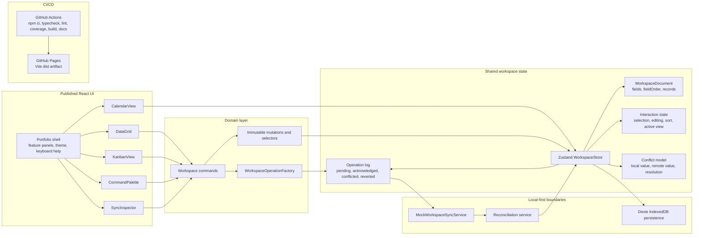

# Enterprise Data Workbench

Enterprise Data Workbench is a portfolio-grade React, TypeScript and Vite application for dense, local-first enterprise data workflows. It showcases a domain-first frontend architecture where table, kanban and calendar views share one workspace document, every mutation is logged as an operation, and sync/reconciliation behavior is visible in the UI.

- **Live demo:** [danielemasone.github.io/enterprise-data-workbench](https://danielemasone.github.io/enterprise-data-workbench/)
- **Source:** [github.com/danielemasone/enterprise-data-workbench](https://github.com/danielemasone/enterprise-data-workbench)
- **Generated API docs:** [GitHub Pages TypeDoc report](https://danielemasone.github.io/enterprise-data-workbench/docs/)
- **Coverage report:** [GitHub Pages coverage report](https://danielemasone.github.io/enterprise-data-workbench/coverage/)

## Why This Project Exists

Enterprise frontends often fail at the places where simple CRUD examples stop: dense editing, overlapping interaction state, optimistic updates, local persistence, keyboard ergonomics, conflict handling and deployment discipline. This project packages those concerns into one inspectable GitHub Pages app.

## Feature Walkthrough

- **Portfolio showcase shell:** first-viewport project pitch, feature panels, live workspace metrics, a workbench-local tabbed demo, keyboard help and an architecture diagram.
- **Data grid:** inline cell editing, keyboard navigation, row selection, sorting, column resizing and column reordering.
- **Shared views:** table, kanban and calendar project the same `WorkbenchRecord` model without duplicated per-view data.
- **Command palette:** `Ctrl/Cmd K` opens view switching, sync and conflict simulation commands.
- **Local-first persistence:** the workspace snapshot is persisted in IndexedDB through Dexie.
- **Optimistic updates:** local commands append `WorkspaceOperation` records and update the UI immediately.
- **Mock synchronization:** pending operations are submitted to a mock sync service that can acknowledge or conflict.
- **Reconciliation:** conflict records preserve local and remote values until the user resolves them.
- **Presence layer:** deterministic fake collaborators show cursor locations and collaboration pressure.
- **Sync inspector:** visible sync mode, pending operations, operation history, conflict simulation and resolution controls.
- **Theme:** dark/light mode toggle that respects system preference on first load and persists explicit `localStorage` preference.
- **Tooling:** strict TypeScript, ESLint, Prettier, Vitest, Testing Library, coverage and TypeDoc.

## Architecture Diagram



The same architecture is rendered inside the published application as a compact HTML diagram.

## Domain Model

The workspace is modeled around domain data rather than UI widgets:

- `WorkspaceField` describes column metadata, field type, width and categorical options.
- `WorkbenchRecord` stores serializable cell values plus record timestamps and version.
- `WorkspaceOperation` captures user mutations for optimistic UI, persistence, replay and inspection.
- `WorkspaceConflict` stores field-level local/remote disagreement until resolution.
- `SyncStatus` reports mode, pending count, last sync time and errors.

Views consume selectors over `WorkspaceDocument`; they do not own separate record caches.

## Sync And Reconciliation

Local commands apply immediately and append a pending operation. The store persists the snapshot, then `flushSync` submits pending operations to `WorkspaceSyncService`. The mock service returns acknowledgements, remote operations and conflicts. `reconcileSyncResult` updates operation status, merges conflicts and keeps remote reconciliation explicit. Users can keep the optimistic local value or accept the remote value in the sync inspector.

## Keyboard UX

- Arrow keys: move selected grid cell.
- `Enter`: start editing or commit the draft value.
- `Escape`: cancel editing or close the command palette.
- `Tab` / `Shift+Tab`: move horizontally through grid cells.
- `Ctrl+K` / `Cmd+K`: open the command palette.
- `Ctrl+S` / `Cmd+S`: flush pending sync operations.

Focus is restored to the selected cell after navigation and editing transitions.

## Screenshots And GIFs

Real screenshots are not committed yet. Suggested showcase captures:

- `docs-assets/table-editing.gif`: inline edit, pending operation, sync acknowledgement.
- `docs-assets/conflict-resolution.gif`: simulate conflict, compare local/remote values, resolve.
- `docs-assets/responsive-pages.png`: GitHub Pages view across desktop and mobile widths.

## Testing Strategy

Vitest runs with Testing Library and jsdom. The suite covers:

- domain selectors, immutable mutations and operation creation
- optimistic updates and workspace store commands
- reconciliation and conflict resolution
- persistence boundaries with mocks and fake IndexedDB
- inline editing commit/cancel flows
- keyboard shortcut hooks and grid navigation
- command palette filtering/execution
- table selection, sorting and column reordering
- kanban movement logic
- calendar projection logic
- sync inspector operation/conflict behavior
- portfolio shell and dark mode persistence

Coverage is generated by `npm run test:coverage` and CI. Generated coverage output is ignored.

Current thresholds:

- statements: 75%
- branches: 65%
- functions: 75%
- lines: 75%

## CI/CD

The GitHub Actions workflow runs on pull requests, pushes to `main` and manual dispatches:

1. `npm ci`
2. `npm run typecheck`
3. `npm run lint`
4. `npm run test:coverage`
5. `npm run build`
6. `npm run docs`
7. Copy generated TypeDoc and coverage reports into `dist/docs/` and `dist/coverage/`
8. Upload Vite `dist/` as a GitHub Pages artifact on non-PR runs
9. Deploy through `actions/deploy-pages`

The workflow follows the current GitHub Pages custom workflow model: `actions/configure-pages`, `actions/upload-pages-artifact` and `actions/deploy-pages`.

References:

- [GitHub Pages custom workflows](https://docs.github.com/pages/getting-started-with-github-pages/using-custom-workflows-with-github-pages)
- [GitHub Pages publishing source](https://docs.github.com/en/pages/getting-started-with-github-pages/configuring-a-publishing-source-for-your-github-pages-site)
- [Vite GitHub Pages deployment](https://vite.dev/guide/static-deploy.html#github-pages)

## GitHub Pages Deployment

Vite is configured for the project page base path:

```ts
base: process.env.VITE_BASE_PATH ?? '/enterprise-data-workbench/'
```

Enable GitHub Pages in repository settings by selecting **GitHub Actions** as the Pages source. CI builds the app, generates docs and coverage, copies those generated reports into the Vite artifact, and deploys only `dist/`. Manual build artifacts are not committed.

## Documentation

TypeDoc generates API documentation from exported workspace domain, service, hook and state modules:

```bash
npm run docs
```

Generated `docs/` output is ignored. On non-PR CI runs it is copied into `dist/docs/` so the published app can link to stable API documentation.

## Local Setup

Use Node 22 or newer.

```bash
npm ci
npm run dev
```

Preview the production build locally:

```bash
npm run build
npm run preview
```

## Scripts

- `npm run dev` - start the Vite dev server.
- `npm run build` - create the production Vite build in `dist/`.
- `npm run preview` - preview the production build locally.
- `npm run test` - run Vitest in watch mode.
- `npm run test:coverage` - run tests and generate coverage reports.
- `npm run typecheck` - run strict TypeScript checking.
- `npm run lint` - run ESLint with zero warnings allowed.
- `npm run docs` - generate TypeDoc output in `docs/`.
- `npm run pages:reports` - copy generated `coverage/` and `docs/` into `dist/` for Pages publishing.
- `npm run ci` - run typecheck, lint, coverage, build, docs and Pages report assembly locally.

## Performance Considerations

- Derived projections keep the table, kanban and calendar views aligned with one document.
- Mutations are immutable and scoped to affected fields, records or layout state.
- Column resize commits on pointer release to avoid flooding the operation log.
- The current grid is suitable for moderate datasets. Very large datasets should add row and column virtualization.
- Sync work is explicit and inspectable, which makes future batching or backoff strategies straightforward.

## Technical Trade-Offs

- Collaboration is mocked. It demonstrates presence, pending operations and conflicts without WebSockets or CRDTs.
- Conflict resolution is field-level and deterministic. Production synchronization would need server versions, authz and richer merge policies.
- Calendar rendering is a compact due-date grouping rather than a full scheduling engine.
- The architecture diagram in the app is HTML/CSS for zero runtime diagram dependency; README uses Mermaid.

## Project Status

Implemented as a stable senior frontend portfolio showcase with a polished GitHub Pages UI, production validation pipeline, local-first architecture, documented trade-offs and meaningful automated tests.
