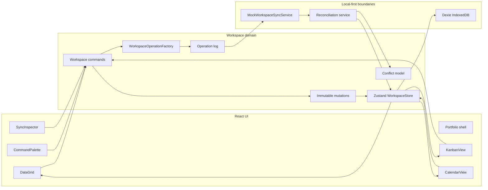
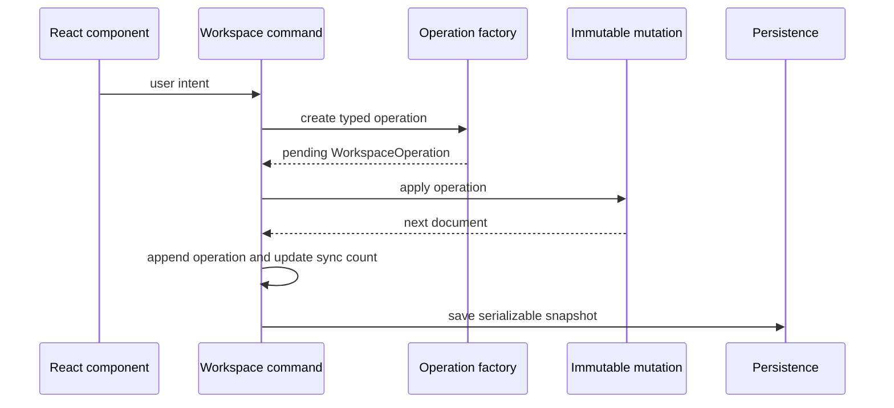

# Architecture Guide

Enterprise Data Workbench uses a domain-first frontend architecture. The React views bind user events to workspace commands, while domain helpers, persistence, synchronization and reconciliation remain outside component-local state.

## System Overview

The compact diagram in the README and the in-app diagram describe the same path at different levels of detail.

## Repository Map

| Area                                | Responsibility                                              |
| ----------------------------------- | ----------------------------------------------------------- |
| `src/modules/workspace/model/`      | Domain terminology and serializable state contracts         |
| `src/modules/workspace/domain/`     | Operation creation, immutable mutation and selectors        |
| `src/modules/workspace/state/`      | Zustand store, commands and React provider                  |
| `src/modules/workspace/services/`   | Persistence, mock sync and reconciliation boundaries        |
| `src/modules/workspace/components/` | Table, kanban, calendar, palette, presence and inspector UI |
| `src/modules/workspace/hooks/`      | Global keyboard shortcut orchestration                      |
| `src/app/`                          | Portfolio shell, shared theme/UI and published User Guide   |
| `src/app/guide/`                    | End-user guide content and dedicated `/guide/` experience   |

## Workspace Domain Model

`WorkspaceDocument` is the shared source of truth:

- `fields`: metadata for types, labels, widths and categorical options.
- `fieldOrder`: the active column order.
- `records`: serializable `WorkbenchRecord` objects.

The important domain types are:

| Type                 | Purpose                                             |
| -------------------- | --------------------------------------------------- |
| `WorkspaceField`     | Column identity, type, width and option metadata    |
| `WorkbenchRecord`    | Shared row/work item consumed by every view         |
| `WorkspaceOperation` | Serializable mutation envelope and lifecycle status |
| `WorkspaceConflict`  | Explicit local/remote field-level disagreement      |
| `SyncStatus`         | Sync mode, pending count, last sync and error state |

`FieldValue` is restricted to `string | number | null` so records and operations can cross persistence and sync boundaries without UI-specific values.

## Shared State Model

`WorkspaceState` combines four explicit concerns:

1. The shared document: fields, field order and records.
2. Interaction state: active view, selection, editing, sorting and palette visibility.
3. Local-first state: operation log, conflicts and sync status.
4. Simulated collaboration state: presence and cursor locations.

Views do not keep their own record collections. This prevents table, kanban and calendar from drifting after edits or reconciliation.

Transient portfolio state stays outside the workspace. The light/dark preference is held by the application shell and persisted separately in `localStorage` because it is not domain data.

## View Projections

### Table

`DataGrid` reads fields, field order, records, selection, editing and sort from the store. UI handlers call commands such as `selectCell`, `commitEditing`, `resizeColumn`, `reorderColumn` and `setSort`.

### Kanban

`KanbanView` groups the shared records by the configured status field. Drag-and-drop and the accessible card action both call `moveRecordToStatus`; neither writes to a kanban-specific cache.

### Calendar

`CalendarView` sorts the shared records and groups them by `dueDate`. It is a read-only projection, so edits remain owned by the table command surface.

## Command And Operation Flow

Commands are the supported mutation surface. Components bind events and render state; they do not directly rewrite records.

## Operation Log And Optimistic Updates

The operation union currently includes:

- `cell.update`
- `record.status.move`
- `column.resize`
- `column.reorder`

Each operation contains before/after data plus identity and lifecycle metadata. New operations begin as `pending`. The domain mutation is applied before synchronization, so the UI responds immediately. The pending count is derived from operation statuses during hydration and reconciliation.

This explicit log provides foundations for inspection, replay and future undo support without hiding work in component state.

## Persistence Boundary

`WorkspacePersistence` defines `load()` and `save()` over `PersistedWorkspace`. `DexieWorkspacePersistence` is the browser implementation backed by IndexedDB.

Only serializable workspace data crosses this boundary. Selection, editing, palette visibility and presence are reconstructed rather than persisted. Tests inject in-memory persistence to verify when snapshots are loaded and saved.

## Mock Synchronization

`WorkspaceSyncService.submitOperations()` accepts the pending operation batch. `MockWorkspaceSyncService` provides deterministic acknowledgements and conflict behavior without requiring a backend.

`flushSync` performs the orchestration:

1. Select pending operations.
2. Set sync mode to `syncing`.
3. Submit through the injected service.
4. Pass the result to reconciliation.
5. Persist the reconciled snapshot.
6. Surface failures through explicit sync error state.

## Reconciliation And Conflicts

`reconcileSyncResult` updates acknowledged/conflicted operation statuses, applies remote operations and merges conflict records. Conflicts remain separate first-class records so the UI can show both values.

Resolution is explicit:

- **Local** keeps the optimistic value and marks the conflict resolved.
- **Remote** applies the remote value, records the resolution and persists the result.

The simulator creates a conflict for the selected cell, allowing the same UI path to be exercised without a server.

## Presence Layer

Presence is deterministic fixture data with user identity, color, cursor address and last-seen time. It is rendered as a collaboration facade but is not synchronized or persisted. A production implementation could replace this source with WebSocket events without changing the workspace document model.

## Key Trade-Offs

- Mock sync demonstrates boundaries and reconciliation, not distributed consistency.
- Field-level conflicts are understandable and testable but do not cover multi-field merge policies.
- The operation log is append-only for inspection; undo/redo is outside the showcase scope.
- The grid is not virtualized and targets moderate portfolio-sized datasets.
- Calendar is a projection, not a scheduling engine.

## Safe Extension Rules

1. Add or refine model types before changing UI components.
2. Represent persistent mutations as typed operations.
3. Implement immutable application in `domain/`.
4. Expose user intent through a store command.
5. Keep external behavior behind an injected service interface.
6. Derive every view from the shared document.
7. Add domain, store and user-flow tests at the appropriate layer.
8. Keep README, the published User Guide, this guide, TypeDoc and the in-app architecture description aligned without copying the same detail between them.

See [AGENTS.md](../AGENTS.md) for the concise operational rules used by future coding agents.
